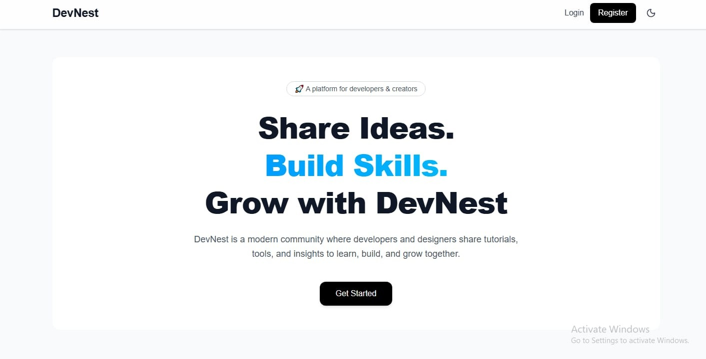
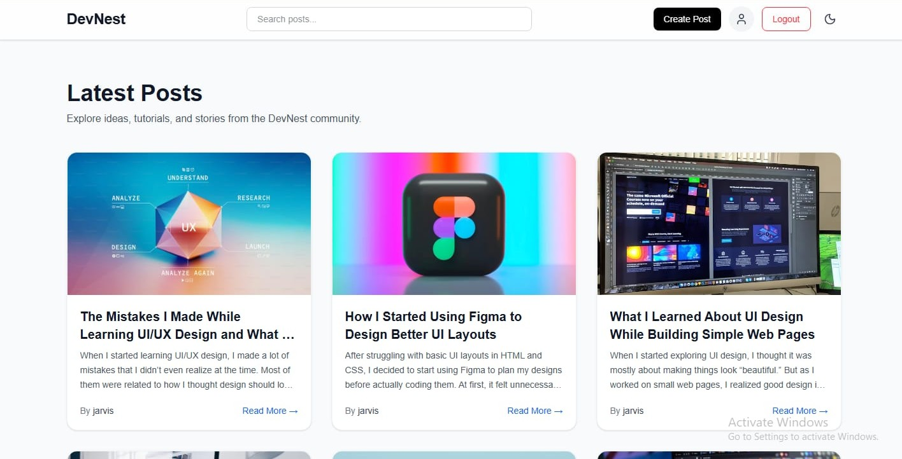
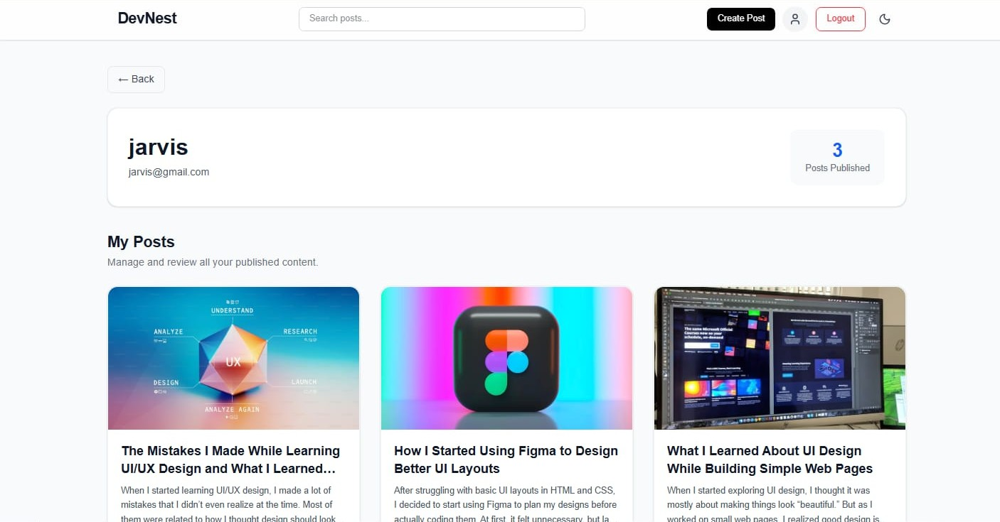

# DevNest

A modern full-stack blogging platform built with the MERN stack where users can read, create, and manage blogs through a clean and responsive interface.

🚀 Live Demo httpsdev-nest-ochre.vercel.app  

---

## ✨ Features

- 🔐 Secure User Authentication & Authorization
- 📝 Create, Edit, and Delete Blog Posts
- 📚 Read and Explore Blogs
- 🔍 Search Functionality for Blogs
- ❤️ Like Blogs
- 👁️ Track Blog Views
- ☁️ Image Upload Support with Cloudinary
- ⚡ REST API Integration
- 📱 Fully Responsive UI
- 🔒 Protected Routes & JWT Authentication
- 🚀 Fast and Modern MERN Stack Architecture
- 🎨 Clean UI with Tailwind CSS
- 🍪 Cookie-Based Authentication
- 🛡️ Security Enhancements using Helmet

---

## 🛠️ Tech Stack

### Frontend

- React.js
- React Router DOM
- Axios
- Tailwind CSS
- React Hot Toast
- React Helmet
- Lucide React
- Vite

### Backend

- Node.js
- Express.js
- MongoDB
- Mongoose
- JWT Authentication
- Bcrypt
- Multer
- Cloudinary
- Cookie Parser
- Express Validator
- CORS
- Dotenv

---

## 📂 Project Structure

```bash
DevNest
│
├── Frontend        # React frontend
├── Backend         # Express + Node backend
└── README.md
```

---

## ⚙️ Installation & Setup

### 1️⃣ Clone the Repository

```bash
git clone httpsgithub.comKaushik-MudaliyarDevNest.git
```

### 2️⃣ Navigate into the Project Directory

```bash
cd DevNest
```

---

# 🔧 Backend Setup

### Install Backend Dependencies

```bash
cd Backend
npm install
```

### Create `.env` File

Create a `.env` file inside the `Backend` folder and add

```env
PORT=

MONGO_DB_URI=

ACCESS_TOKEN_SECRET=
REFRESH_TOKEN_SECRET=

ACCESS_TOKEN_EXPIRY=
REFRESH_TOKEN_EXPIRY=

CLOUDINARY_CLOUD_NAME=
CLOUDINARY_API_KEY=
CLOUDINARY_API_SECRET=
```

### Start Backend Server

```bash
npm run dev
```

---

# 💻 Frontend Setup

### Install Frontend Dependencies

```bash
cd Frontend
npm install
```

### Create `.env` File

Create a `.env` file inside the `Frontend` folder and add

```env
VITE_API_URL=your_backend_url
```

### Run Frontend

```bash
npm run dev
```
---

## 🚀 Live Demo

🔗 httpsdev-nest-ochre.vercel.app

---

## 📸 Preview

| Home Page | Blog Page |
|-----------|------------|
|  |  |

| Dashboard Page | 
|-----------|
|  |

---

## 📖 What I Learned

While building DevNest, I gained hands-on experience with

- Full-stack MERN development
- Authentication using JWT & Cookies
- REST API development
- MongoDB database integration
- Cloudinary image uploads
- Backend security best practices
- Responsive frontend development
- Deployment and project structuring

---

## 🌱 Future Improvements

- Rich Text Editor
- Blog Categories & Tags
- Comment System
- User Profiles
- Bookmark System
- Admin Dashboard

---

## 🤝 Contributing

Contributions, suggestions, and feedback are welcome.

Fork the repository and create a pull request.

---

## 👨‍💻 Author

### Kaushik Mudaliyar

- GitHub httpsgithub.comKaushik-Mudaliyar

---

## ⭐ Support

If you liked this project, consider giving it a star on GitHub ⭐
